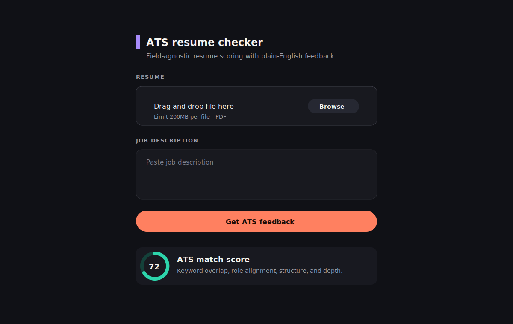

# ATS Resume Checker

This Streamlit app compares a PDF resume against a pasted job description and returns field-agnostic ATS-style feedback. The core score is deterministic so it works across software, medical, business, finance, education, and other roles. A local MLX model can optionally explain the result on Apple Silicon.

Live app: https://atsresumecheckershrey.streamlit.app/

The optional default MLX model is:

```text
mlx-community/gemma-3-1b-it-4bit
```

## Features

- Upload a resume as a PDF
- Paste a job description
- Extract resume text with PyMuPDF
- Generate an ATS match score, matched keywords, missing keywords, role gaps, resume changes, recommendations, and summary verdict
- Write runtime logs for debugging and analysis

## Screenshots



## Documentation

- [Project architecture](docs/architecture.md)
- Runtime logs: `logs/ats_resume_checker.log`

## Requirements

- Python
- Streamlit
- PyMuPDF
- mlx-lm
- Apple Silicon Mac for local MLX inference

## Run Locally

```bash
pip install -r requirements.txt
streamlit run app.py
```

To use a different MLX model, set it in Streamlit secrets:

```toml
MLX_MODEL = "path-or-mlx-model-repo"
```

## Deploy on Streamlit Cloud

Use these settings when creating the app in Streamlit Cloud:

- Repository: `shreyshrivastava/ats_resume_checker_gemma3_hf`
- Branch: `streamlit-cloud`
- Main file path: `app.py`

Note: MLX is designed for Apple Silicon Macs. Streamlit Cloud typically runs Linux containers, so this branch is best for local MLX use unless your deployment runtime supports MLX.

## Project Structure

```text
app.py                 # Streamlit entry point
backend/scorer.py      # Deterministic field-agnostic ATS scoring
backend/processor.py   # PDF-to-report orchestration and optional MLX explanation
frontend/ui.py         # Streamlit input controls
utils/pdf_reader.py    # PDF text extraction
utils/logging_config.py # Runtime logging setup
```
