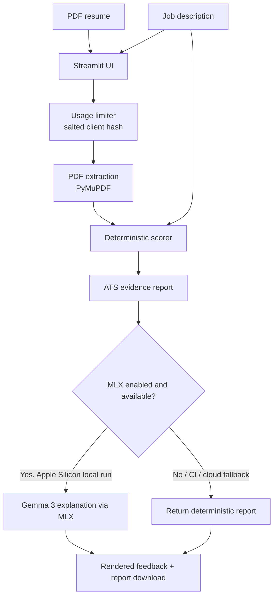

# ATS Resume Checker

Deterministic resume-to-job matching for PDF resumes, with optional local Gemma 3 explanations through MLX on Apple Silicon.

Public demo status: deployment is prepared for Streamlit Cloud, but `https://atsresumecheckershrey.streamlit.app/` currently redirects to Streamlit login and has not been verified as a public URL.

## Why this project matters

This project demonstrates practical AI engineering judgment: deterministic scoring remains the source of truth, while the LLM is treated as an optional explanation layer. The app can run in CI and public cloud environments without GPU access or private model downloads, and local Apple Silicon users can still enable MLX explanations when they want generative feedback.

## Features

- PDF resume upload with PyMuPDF text extraction
- Deterministic ATS-style scoring from keyword overlap, role-title alignment, resume structure, and content depth
- Evidence-preserving report output with matched keywords, missing terms, role gaps, score breakdown, and resume edits
- Optional MLX/Gemma 3 explanation layer that cannot change the deterministic score or scoring evidence
- Streamlit UI with downloadable Markdown reports
- Two-analysis-per-client limit for public demos, keyed by salted client-address hash rather than raw IP storage
- Controlled PDF errors for empty, malformed, oversized, scanned, or image-only files
- Synthetic evaluation dataset and latency benchmark scripts
- Fast CI workflow that avoids MLX, GPU, paid APIs, and private secrets

## Screenshot


## Architecture



The deterministic scorer in `backend/scorer.py` owns the score. `backend/processor.py` may ask MLX to explain the result, but the prompt explicitly prevents the model from changing the score, matched keywords, missing keywords, or evidence.

## Evaluation

The evaluation uses synthetic, anonymized resume/job-description pairs in `evaluation/datasets/resume_job_pairs.json`.

Latest measured local run:

- Cases: `6`
- Ranking groups: `2`
- Ranking consistency: `100.00%`
- Strong/moderate/weak order passed for Applied AI Engineer and Staff Nurse examples

Run it:

```bash
python evaluation/run_evaluation.py
```

Outputs:

- `evaluation/results.json`
- `evaluation/results.md`

## Benchmarks

The benchmark uses a synthetic text-based PDF and synthetic job description. These numbers are one local run, not universal performance claims.

Latest measured local run:

- Environment: Python `3.14.5`, macOS `26.5.2`, arm64
- Iterations: `10`
- PDF extraction median: `1.00 ms`
- Deterministic scoring median: `0.75 ms`
- Total analysis without MLX median: `2.90 ms`
- Score reproducible: `True`

Run it:

```bash
python benchmarks/run_benchmarks.py --iterations 10
```

Outputs:

- `benchmarks/results.json`
- `benchmarks/results.md`

## Setup

```bash
python -m venv .venv
source .venv/bin/activate
pip install -r requirements.txt
pip install -r requirements-dev.txt
streamlit run app.py
```

Base dependencies do not include MLX so Linux CI and Streamlit Cloud can run deterministic mode.

To enable local MLX explanations on Apple Silicon:

```bash
pip install -r requirements-mlx.txt
ATS_ENABLE_MLX=1 streamlit run app.py
```

## Configuration

| Variable | Default | Purpose |
| --- | --- | --- |
| `ATS_ENABLE_MLX` | `auto` | `auto`, `1`, or `0`; controls optional MLX explanations |
| `MLX_MODEL` | `mlx-community/gemma-3-1b-it-4bit` | MLX model name or local model path |
| `ATS_MLX_TIMEOUT_SECONDS` | `300` | Timeout for MLX explanation generation |
| `ATS_MAX_PDF_BYTES` | `8388608` | Uploaded PDF size limit |
| `ATS_USAGE_LIMIT` | `2` | Analysis runs allowed per client address |
| `ATS_USAGE_LIMIT_ENABLED` | `1` | Set `0` to disable the public-demo limiter locally |
| `ATS_USAGE_LIMIT_PATH` | `/tmp/ats_resume_checker_usage.json` | File-backed usage counter path |
| `ATS_USAGE_SALT` | generated state salt | Optional HMAC salt for client-address hashing |

## Testing

```bash
ruff check .
python -m compileall app.py backend frontend utils evaluation benchmarks tests
pytest -m "not mlx"
python evaluation/run_evaluation.py
python benchmarks/run_benchmarks.py --iterations 1
```

Optional real MLX smoke test:

```bash
RUN_MLX_TESTS=1 ATS_ENABLE_MLX=1 pytest -m mlx
```

The normal CI path does not require Apple Silicon, MLX, a GPU, paid APIs, local model downloads, or private data.

## Deployment

The app is deployable to Streamlit Cloud in deterministic fallback mode. Streamlit Cloud normally runs Linux, so MLX explanations should be disabled there.

Recommended Streamlit Cloud settings:

- Repository: `shreyshrivastava/ats_resume_checker_gemma3_hf`
- Branch: `main` after these changes are merged
- Main file path: `app.py`
- Environment/secrets: `ATS_ENABLE_MLX=0`

For local Apple Silicon demos, install `requirements-mlx.txt` and set `ATS_ENABLE_MLX=1`.

## Privacy

The app processes uploaded resumes and pasted job descriptions at runtime. Runtime logs include filenames, character counts, scoring metadata, and fallback events, but should not contain resume text, job-description text, raw IP addresses, or API keys. The public-demo limiter stores a salted hash of the client identifier plus a run count.

See `docs/privacy.md` for details.

## Limitations

- The score is a heuristic ATS-style match score, not a real vendor ATS result.
- The evaluation dataset is small and synthetic.
- Scanned/image-only PDFs are rejected unless OCR has already been applied.
- The file-backed usage limiter is suitable for a lightweight demo, not a durable abuse-prevention system across redeploys or multiple replicas.
- MLX explanations are local Apple Silicon only unless the deployment runtime supports MLX and Apple Metal.

## Project Structure

```text
app.py                         Streamlit entry point
backend/scorer.py              Deterministic ATS scoring
backend/processor.py           PDF-to-report orchestration and optional MLX explanation
frontend/ui.py                 Streamlit input and feedback rendering
utils/pdf_reader.py            Safe PDF extraction
utils/usage_limiter.py         Privacy-aware per-client run limiter
evaluation/                    Synthetic ranking consistency evaluation
benchmarks/                    Latency and reproducibility benchmarks
tests/                         Pytest suite
.github/workflows/ci.yml       Fast CI checks
.github/workflows/benchmark.yml Manual/scheduled benchmark workflow
docs/                          Architecture, deployment, privacy, limitations, audit
examples/                      Synthetic sample inputs and outputs
```

## Roadmap

- Add OCR fallback for scanned PDFs.
- Add a larger synthetic evaluation set across more job families.
- Add screenshot generation for successful analysis output.
- Move usage limits to durable storage if the public demo needs stronger abuse protection.
- Add a verified public URL after Streamlit Cloud sharing is enabled.

## License

No license file is currently present. Add an explicit license before encouraging reuse.
