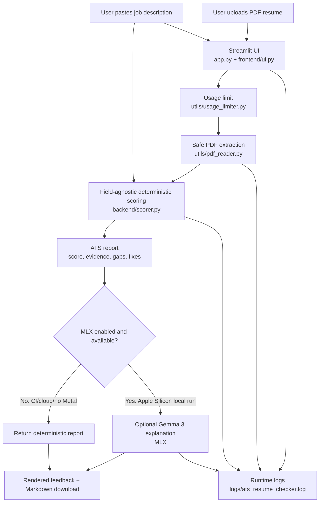

# Project Architecture

The app is a hybrid ATS-style checker:

- `backend/scorer.py` creates the score and evidence deterministically.
- `backend/processor.py` can ask MLX/Gemma 3 to explain the deterministic report.
- The LLM is not allowed to change the score, matched keywords, missing keywords, or evidence.
- Public deployments can run in deterministic mode when MLX/Apple Metal is unavailable.

## System Diagram



## Runtime Flow

1. `app.py` configures logging and renders the Streamlit page.
2. `frontend/ui.py` collects the PDF resume and job description.
3. `utils/usage_limiter.py` checks the client run limit before analysis.
4. `utils/pdf_reader.py` extracts text from the uploaded PDF with size and validity checks.
5. `backend/scorer.py` calculates deterministic ATS signals:
   - matched keywords
   - missing or weak keywords
   - role/title alignment
   - resume section structure
   - content depth
   - role gaps
   - resume changes for the target job
6. `backend/processor.py` returns the deterministic report unless MLX is explicitly enabled or automatically available on Apple Silicon.
7. `frontend/ui.py` renders score, keyword evidence, gaps, recommendations, and a downloadable Markdown report.

## Deterministic Versus Generative Responsibilities

The deterministic scorer owns:

- score
- verdict
- matched and missing terms
- score breakdown
- role gaps
- resume-change recommendations

The optional MLX layer owns only explanation wording. If MLX fails, times out, or is unavailable, the deterministic report is returned without changing the app flow.

## Usage Limiting

The public-demo limiter allows two analysis runs per client identifier by default. It uses Streamlit context IP data when available and stores only a salted HMAC hash plus run count in a local JSON file. It does not store raw IP addresses.

This is a lightweight demo-control mechanism, not durable abuse prevention across redeploys, replicas, or state resets.

## Logging

Runtime logs are written to:

```text
logs/ats_resume_checker.log
```

The log file is ignored by git. It captures startup, blocked submissions, accepted submissions, filenames, text lengths, scoring metadata, MLX attempts/failures, and fallback behavior. It should not contain full resume text, full job-description text, raw IP addresses, API keys, or model outputs.

## Key Files

```text
app.py                    Streamlit entry point and submit flow
frontend/ui.py            UI styling, input controls, and feedback rendering
backend/scorer.py         Deterministic field-agnostic ATS scoring
backend/processor.py      PDF-to-report orchestration and optional MLX explanation
utils/pdf_reader.py       Safe PDF text extraction
utils/usage_limiter.py    Privacy-aware per-client run limiting
utils/logging_config.py   Console and file logging setup
```
