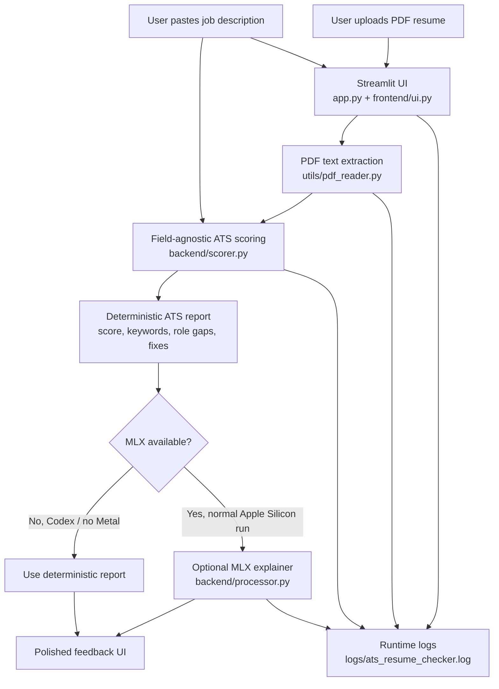

# Project Architecture

The app is designed as a hybrid ATS checker:

- A deterministic scoring engine creates the ATS score and evidence.
- The optional MLX model explains the result in more natural language when local Apple Metal is available.
- The UI renders the score, role gaps, keyword matches, and resume changes as readable feedback.

## System Diagram



## Runtime Flow

1. `app.py` configures logging and renders the Streamlit page.
2. `frontend/ui.py` collects the PDF resume and job description.
3. `utils/pdf_reader.py` extracts plain text from the uploaded PDF using PyMuPDF.
4. `backend/scorer.py` calculates deterministic ATS signals:
   - matched keywords
   - missing or weak keywords
   - role/title alignment
   - resume section structure
   - content depth
   - role gaps
   - resume changes for the target job
5. `backend/processor.py` returns the deterministic report in Codex or other no-Metal environments.
6. On a normal Apple Silicon Mac, `backend/processor.py` can use MLX as an optional explanation layer.
7. `frontend/ui.py` renders the score ring, keyword lists, role gaps, resume-change guidance, and score breakdown.

## Logging

Runtime logs are written to:

```text
logs/ats_resume_checker.log
```

The log file is intentionally ignored by git. It captures:

- app startup
- blocked submissions
- accepted submissions
- uploaded filename and job-description length
- extracted resume text size
- computed score and verdict
- MLX generation attempts and failures
- fallback behavior in Codex/no-Metal environments

## Key Files

```text
app.py                    Streamlit entry point and submit flow
frontend/ui.py            UI styling, input controls, and feedback rendering
backend/scorer.py         Deterministic field-agnostic ATS scoring
backend/processor.py      PDF-to-report orchestration and optional MLX explanation
utils/pdf_reader.py       PDF text extraction
utils/logging_config.py   Console and file logging setup
```
